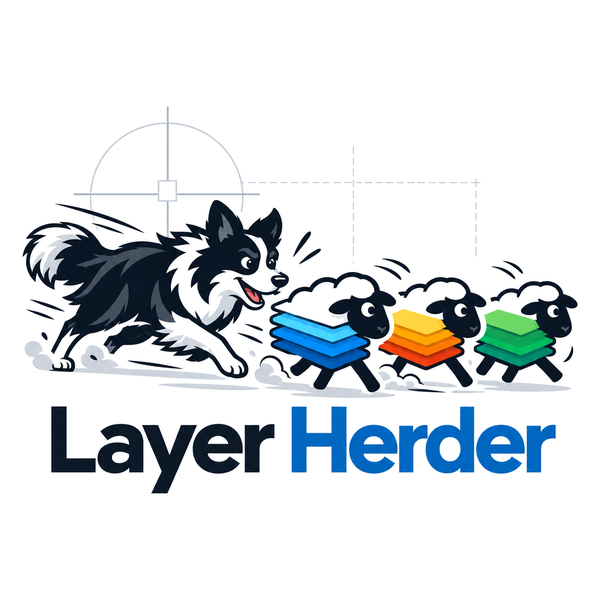

# Layer Herder
Tidy your drawings. Herd your layers into shape.

Free, offline AutoCAD plug-in that herds drawing layers into your standard. Windows. Formerly ACAD Layer Standardizer.

Type `HERD` in AutoCAD, or use the Layer Herder button on the Add-ins ribbon tab.

### 🌐 [Visit the project website](https://yiannias.github.io/LayerHerder/) for screenshots, a full walkthrough, and the download link.

This is a tool to read and map existing layers within an AutoCAD file to an established layer standard. 

In other words a "layer translator" but one with a running memory of previous mapping efforts and enough logic to make suggestions.  For instance, if "TEXT" is favored as a designator instead of "TXT" it will suggest this even if the initial layer was not encountered before. I guess this is "pattern matching."

## Supported AutoCAD versions

**AutoCAD 2021 and newer** (including verticals such as Civil 3D, Map 3D, Plant 3D). One installer covers all supported releases — it ships a build for each AutoCAD .NET compatibility era and AutoCAD automatically loads the right one:

| AutoCAD release | Runtime |
|---|---|
| 2021–2024 | .NET Framework 4.8 |
| 2025–2026 | .NET 8 |
| 2027 | .NET 10 |

**AutoCAD 2020 and older are not supported.**

## Code signing policy

Free code signing provided by SignPath.io, certificate by SignPath Foundation.

Team roles: Author and approver: Chris Yiannias (GitHub: yiannias). Reviewer: none (single maintainer).

Only release binaries built from the tagged source in this repository are signed. Each signing request is approved by the maintainer before the certificate is applied.

## Privacy

Layer Herder is fully offline. It makes no network connections, does not check for updates, and collects no data. Settings and translation memory are stored only on your computer, in your user profile (`%APPDATA%\AcLayerStandardizer`). The only outbound action is the Settings link to the project website, which opens in your own browser when you click it.

## Code of conduct

This project follows the [Contributor Covenant](CODE_OF_CONDUCT.md).
